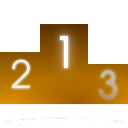

# MClient 7.0

[Описание и задачи](#описание-и-задачи)

[Требования к системе](#требования-к-системе)

[Установка и запуск](#установка-и-запуск)
  - [Запуск сборки](#запуск-сборки)
    - [Запуск сборки в Windows](#запуск-сборки-в-windows)
    - [Запуск сборки в Linux](#запуск-сборки-в-linux)
  - [Запуск скрипта](#запуск-скрипта)
    - [Запуск скрипта в Windows](#запуск-скрипта-в-windows)
    - [Запуск скрипта в Linux](#запуск-скрипта-в-linux)

[Использование и возможности](#использование-и-возможности)

[Управление с помощью клавиатуры и мыши](#управление-с-помощью-клавиатуры-и-мыши)

[Конфигурационный файл](#конфигурационный-файл)

[Цвета](#цвета)

[Шрифты](#шрифты)
  - [Шрифты в Windows](#шрифты-в-windows)
  - [Шрифты в Linux](#шрифты-в-linux)

[Кнопки](#кнопки)

[Ошибки](#ошибки)

[Разработчикам](#разработчикам)

***

## Описание и задачи

Multitran Online Client &mdash; это программа, которая осуществляет соединение
с сайтом [multitran.com](https://www.multitran.com/) и возвращает перевод слов
и фраз, введенных пользователем. Локальные словари в форматах Stardict, Lingvo
(DSL) и Multitran (демо-версия) поддерживаются на начальном уровне. Данная
программа позволяет обеспечить более быстрый доступ к элементам статьи, а также
их сортировку, приоритизацию\/блокировку тематик и т.п. Статьи представлены в
виде настраиваемой таблицы.

## Требования к системе

Операционная система: Windows 10 (или новее) или Linux.

Работа на Mac OS X не тестировалась, но каких-либо причин, существенно
препятствующих запуску программы под этой системой, нет.

Требуется наличие интернета (для онлайн-словарей).

Свободное пространство на жестком диске: 244 Мб (сборка под Linux).

Свободная оперативная память: 115 Мб (сборка под Linux).

## Установка и запуск

Вы можете запускать как сборку (с расширением `.exe` для Windows и `.AppImage`
для Linux), так и сам скрипт (исходный код). Сборка не требует установки,
просто скопируйте ее в нужное место на диске. Для запуска скрипта установите
Python 3 и все сопутствующие модули.

### Запуск сборки

#### Запуск сборки в Windows

Для запуска необходима Windows 10 или новее. Может потребоваться установка
обновлений Windows и [vcredist](https://www.microsoft.com/ru-ru/download/details.aspx?id=48145).

1. Загрузите [mclient_win64.7z](https://github.com/sklprogs/mclient/releases/download/latest/mclient_win64.7z).
1. Распакуйте архив в каталог, доступный для записи (может потребоваться [7-zip](https://www.7-zip.org/)).
1. Запустите `mclient.cmd`.

#### Запуск сборки в Linux

1. Загрузите [mclient-linux-x86_64-glibc2.36.AppImage](https://github.com/sklprogs/mclient/releases/download/latest/mclient-linux-x86_64-glibc2.36.AppImage).
1. Версия glibc должна быть 2.36 или новее. Чтобы узнать текущую версию,
выполните `ldd --version`. Если версия слишком старая, обновите систему.
1. Установите FUSE (если отсутствует).
1. Разрешите выполнение файла (например, выполнив `chmod +x mclient-linux-x86_64-glibc2.36.AppImage`).
1. Запустите файл как обычное приложение.

### Запуск скрипта

#### Запуск скрипта в Windows

1. Установите [Git for Windows](https://git-scm.com/download/win).
   - Выберите опцию **Git from the command line and also from 3rd-party
     software**.
2. Запустите терминал (например, нажав `Win+R` и введя `cmd`).
3. Введите следующее:
```
cd %USERPROFILE%
mkdir sklprogs
cd sklprogs
git clone https://github.com/sklprogs/shared_qt.git
git clone https://github.com/sklprogs/mclient.git
```
4. Установите [Python 3](https://www.python.org/) в `C:\Python`.
   - Выберите добавление Python в `PATH`.
5. Обновите `pip`, введя в терминале `python -m pip install --upgrade pip`.
6. Установите зависимости:
   `pip install -r "%USERPROFILE%\sklprogs\mclient\docs\requirements.txt"`.
7. Установите pyWinhook: `pip install pywinhook`.
8. Настройте и запустите программу:
```
move sklprogs\shared_qt\src C:\Python\Lib\site-packages\skl_shared_qt
move sklprogs\shared_qt\resources C:\Python\Lib\site-packages\resources
python sklprogs\mclient\src\mclient.py
```

#### Запуск скрипта в Linux

1. Откройте терминал и введите следующее (команды и названия пакетов могут
отличаться в зависимости от дистрибутива):
```
sudo apt-get install git python3 python3-xlib python3-venv
mkdir ~/sklprogs
cd ~/sklprogs
git clone https://github.com/sklprogs/shared_qt.git
git clone https://github.com/sklprogs/mclient.git
python3 -m venv mclient_venv
source "./mclient_venv/bin/activate"
python3 -m pip install --upgrade pip
pip install -r "./mclient/docs/requirements.txt"
```
2. Настройте и запустите программу (пути могут отличаться в зависимости от
   версии Python):
```
ln -s "$HOME/sklprogs/shared_qt/src" "$HOME/sklprogs/mclient_venv/lib/python3.11/site-packages/skl_shared_qt"
ln -s "$HOME/sklprogs/shared_qt/resources" "$HOME/sklprogs/mclient_venv/lib/python3.11/site-packages/resources"
python3 "$HOME/sklprogs/mclient/src/mclient.py"&
deactivate
```

Антивирусы могут выдавать предупреждение о наличии кейлоггера, поскольку
MClient перехватывает нажатия `Ctrl`, `Ins` и `c` в других приложениях для
отслеживания буфера обмена. Информация о нажимаемых клавишах нигде не
хранится и никуда не отсылается. Если сочетания клавиш `Ctrl+C+C` и
`Ctrl+Ins+Ins` у вас не работают, внесите MClient в список исключений в
антивирусах и отключите менеджеры буфера обмена (при их наличии).

## Использование и возможности 

Для работы с онлайн-словарями постоянно нужен интернет. Если статью не
получится загрузить с сайта, то будет выдано соответствующее
предупреждение. Вам необходимо будет проверить наличие интернета и
доступность сайтов ([multitran.com](https://www.multitran.com) и др.). Часто
бывает достаточно нажать **OK** сразу после появления этой ошибки.

Запрос можно состоять как из одного, так и из нескольких слов. Если запрос
в текущем склонении или числе не найден, Мультитран автоматически подбирает
нужное склонение и число. Таким образом, если вы введете *пищевых красителей*,
то Мультитран покажет статью *пищевой краситель*.

Программа корректно работает с такими символами, как *á*, *ß*, *è* и пр.

## Управление с помощью клавиатуры и мыши

Обозначения: ЛКМ &mdash; левая кнопка мыши, ПКМ &mdash; правая кнопка мыши,
СКМ &mdash; средняя кнопка мыши.

| Действие | Управление с помощью мыши | Управление с помощью клавиатуры | Ключ в конфигурационном файле |
| --- | --- | --- | --- |
| Выйти из программы | Нажать  или кнопку закрытия | `Ctrl+Q`, `Alt+F4`, `F10` | `actions → quit` |
| Свернуть окно | Нажать СКМ | `Esc` | |
| Вернуть перевод выделенной ячейки | Нажать ЛКМ или  | `Enter` | |
| Показать сведения о программе |  | `F1` | `actions → toggle_about` |
| Перейти на ближайшую ячейку слева | Навести указатель | `←` | |
| Перейти на ближайшую ячейку справа | Навести указатель | `→` | |
| Перейти на предыдущую ячейку текущего столбца | Навести указатель | `↑` | |
| Перейти на следующую ячейку текущего столбца | Навести указатель | `↓` | |
| Перейти на первую ячейку текущей строки | Навести указатель | `Home` | |
| Перейти на последнюю ячейку текущей строки | Навести указатель | `End` | |
| Перейти на первую ячейку первой строки | Использовать СКМ или ползунок | `Ctrl+Home` | |
| Перейти на последнюю ячейку последней строки | Использовать СКМ или ползунок | `Ctrl+End` | |
| Перейти на предыдущую страницу | Использовать СКМ или ползунок | `PageUp` | |
| Перейти на следующую страницу | Использовать СКМ или ползунок | `PageDown` | |
| Перейти в предыдущий раздел столбца №1 | Использовать СКМ или ползунок | `Ctrl+Up` | `actions → col1_up` |
| Перейти в следующий раздел столбца №1 | Использовать СКМ или ползунок | `Ctrl+Down` | `actions → col1_down` |
| Перейти в предыдущий раздел столбца №2 | Использовать СКМ или ползунок | `Alt+Up` | `actions → col2_up` |
| Перейти в следующий раздел столбца №2 | Использовать СКМ или ползунок | `Alt+Down` | `actions → col2_down` |
| Перейти в предыдущий раздел столбца №3 | Использовать СКМ или ползунок | `Shift+Up` | `actions → col3_up` |
| Перейти в следующий раздел столбца №3 | Использовать СКМ или ползунок | `Shift+Down` | `actions → col3_down` |
| Перейти в предыдущий раздел столбца №4 | Использовать СКМ или ползунок | `Ctrl+Shift+Up` | `actions → col4_up` |
| Перейти в следующий раздел столбца №4 | Использовать СКМ или ползунок | `Ctrl+Shift+Down` | `actions → col4_down` |
| Искать вперед | | `F3` | `actions → search_article_forward` |
| Искать назад | | `Shift+F3` | `actions → search_article_backward` |
| Начать новый поиск |  | `Ctrl+F3` | `actions → re_search_article` |
| Перезагрузить статью |  | `F5`, `Ctrl+R` | `actions → reload_article` |
| Открыть в браузере |  | `F7`, `Ctrl+B` | `actions → open_in_browser` |
| Выбрать следующий язык оригинала | ЛКМ на выпадающем списке языков | `F8`, `Ctrl+K` | `actions → next_lang1` |
| Выбрать предыдущий язык оригинала | ЛКМ на выпадающем списке языков | `Shift+F8`, `Shift+Ctrl+K` | `actions → prev_lang1` |
| Выбрать следующий язык перевода | ЛКМ на выпадающем списке языков | `F9`, `Ctrl+L` | `actions → next_lang2` |
| Выбрать предыдущий язык перевода | ЛКМ на выпадающем списке языков | `Shift+F9`, `Shift+Ctrl+L` | `actions → prev_lang2` |
| Открыть веб-страницу с определением заголовка текущей статьи |  | | |
| Открыть веб-страницу с определением текста текущего блока | | `Ctrl+D` | `actions → define` |
| Сохранить или скопировать текущую статью |  | `Ctrl+S` | `actions → save_article` |
| Скопировать URL текущей статьи | | `Ctrl+F7` | `actions → copy_article_url` |
| Скопировать URL текущей ячейки | | `Shift+F7` | `actions → copy_url` |
| Скопировать текст выделенной ячейки | Нажать ПКМ | `Ctrl+Enter` | `actions → copy_sel` |
| Скопировать словоформу, соответствующую выделенной ячейке | Выделить словоформу и нажать ПКМ | `Ctrl+W` | `actions → copy_nominative` |
| Посмотреть перевод фраз | | `Alt+F` | `actions → go_phrases` |
| Перевести содержимое буфера обмена из стороннего приложения | | `Ctrl+C+C`, `Ctrl+Ins+Ins` | |
| Вставить содержимое буфера обмена | Нажать ПКМ в строке поиска и выбрать **Paste** или нажать  | `Ctrl+V` | |
| Вставить текущий запрос |  | `!` | |
| Вставить предыдущий запрос |  | `!!` | |
| Вставить специальный символ |  | `Ctrl+E` | `actions → toggle_spec_symbols` |
| Показать\/закрыть историю |  | `F4, Ctrl+H` | `actions → toggle_history` |
| Очистить историю | | `Ctrl+Shift+Del` | `actions → clear_history` |
| Перейти на предыдущую статью |  | `Alt+Left` | `actions → go_back` |
| Перейти на следущую статью |  | `Alt+Right` | `actions → go_next` |
| Перейти на элемент истории | ЛКМ | ↑, ↓ | |
| Скопировать заголовок элемента истории | ПКМ | | |
| Печать (предварительный просмотр) |  | `Ctrl+P` | `actions → print` |
| Включить\/отключить поблочный режим | | `F2` | `actions → select_block` |
| Показать список блокируемых тематик | | `Ctrl+Shift+B` | `actions → show_block` |
| Показать список приоритетных тематик | | `Ctrl+Shift+P` | `actions → show_prior` |
| Показать настройки |  | `Alt+S`, `F12` | `actions → toggle_settings` |
| Поменять местами языки оригинала и перевода |  | `Ctrl+Shift+Space` | `actions → swap_langs` |
| Включить\/отключить сортировку ячеек по алфавиту |  | `Alt+A` | `actions → toggle_alphabet` |
| Включить\/отключить приоритизацию тематик |  | `Alt+P` | `actions → toggle_priority` |

Сочетания клавиш можно сменить в конфигурационном файле.

Языковую пару можно выбрать в выпадающем списке. Обратите внимание, что,
например, если выбрана языковая пара Английский-Русский, то вам не нужно
отдельно переключаться на Русский-Английский (не считая раскладки
клавиатуры) &mdash; Мультитран сам способен определить язык вводимого вами
термина. Ввиду особенностей сайта multitran.com, направления
«русский-казахский» и «казахский-русский» реализованы отдельно.

Чтобы переключаться с помощью клавиатуры между кнопками, нажимайте Tab или
Shift+Tab. Активировать кнопку можно с помощью левой кнопки мыши, Enter
(кнопка на основной или расширенной клавиатуре) или пробела.

Чтобы вставить символ, отсутствующий на клавиатуре, нажмите кнопку
. Вы
можете по собственному усмотрению удалять или пополнять имеющиеся символы (см.
раздел `actions → toggle_spec_symbols` конфигурационного файла).

Вы можете показать\/скрыть историю запросов, нажав
.
Вы можете повторить запрос, единожды нажав на нужный термин в истории. Поле
запросов можно прокручивать с помощью колесика мыши.

Нажмите ,
чтобы переводить термины из буфера обмена. Языковая пара, как и всегда,
определяется значением, заданным в выпадающем списке. При нажатии `Ctrl+C+C` или
`Ctrl+Ins+Ins` в любом приложении, поддерживающем копирование текста по `Ctrl+C`\/`Ctrl+Ins`,
MClient загрузит новую статью в соответствии с содержимым буфера обмена.

Для того, чтобы открыть текущую статью в браузере по умолчанию, нажмите
.

Чтобы узнать толкование заголовка статьи, нажмите
. Чтобы
узнать толкование выделенного блока, используйте комбинацию Ctrl+D
(раздел `actions → define` конфигурационного файла). 

Программа на данный момент поддерживает 2 языка интерфейса &mdash; русский и
английский. Язык интерфейса автоматически определяется в зависимости от
языка системы.

Чтобы просмотреть информацию об авторе и лицензии, нажмите
.

Чтобы выйти из программы, нажмите кнопку закрытия в основном окне или
. При
этом также следует закрыть все оставшиеся окна программы (например, окно
настроек).

## Конфигурационный файл

Вы можете задать свои настройки в конфигурационном файле
`mclient.json`, который находится в каталоге
`C:\users\<USER>\Application Data\mclient` (Windows) или
`$HOME/.config/mclient` (Linux). Если конфигурационный файл отсутствует,
то он будет создан. Если новая версия программы использует новые ключи, они
должны автоматически добавиться в имеющийся конфигурационный файл, не
затрагивая уже имеющиеся ключи. Однако, если ключ `config → min_version`
отсутствует или его значение меньше принимаемого программой, то
конфигурационный файл будет принудительно обновлен, а значения всех ключей
будут заданы по умолчанию.

## Цвета

Цвета определены соответствующими ключами [конфигурационного файла](#конфигурационный-файл).
Измените значение ключа `color` нужного объекта, указав название цвета из
[этого списка](https://www.w3.org/TR/SVG11/types.html#ColorKeywords),
либо корректный HEX-код любого цвета (первым символом указывается `#`, далее
следуют 6 латинских букв). Если в конфигурационном файле указано название
цвета, то значение его ключа может быть перезаписано соответствующим HEX-кодом.
HEX-код цвета можно определить на различных веб-сайтах, например,
[здесь](https://www.colorhexa.com).

Цвета приоритетных и блокируемых тематик подбираются автоматически в
зависимости от цвета текста столбца, в котором они указаны. Цвет приоритетной
тематики более насыщен, а цвет блокируемой тематики &mdash; менее насыщен, чем
цвет текста соответствующего столбца. Чтобы изменить цвет текста столбца и,
соответственно, цвета тематик, задайте значения ключа `columns → 1 → font →
color` (вместо `1` укажите номер нужного столбца в диапазоне 1&ndash;4).

| Объект | Ключ конфигурационного файла | Цвет по умолчанию | HEX-код |
| --- | --- | --- | --- |
| Линия, ограничивающая ячейку по высоте | `rows → border → color` | | `#CCCCCC` |
| Текст столбца №1 | `columns → 1 → font → color` | *coral* | `#FF7F50` |
| Текст столбца №2 | `columns → 2 → font → color` | *cadet blue* | `#5F9EA0` |
| Текст столбца №3 | `columns → 3 → font → color` | *slate gray* | `#708090` |
| Текст столбца №4 | `columns → 4 → font → color` | *slate gray* | `#708090` |
| Текст комментариев | `comments → font → color` | *gray* | `#808080` |
| Текст терминов | `terms → font → color` | *black* | `#000000` |

## Шрифты

### Шрифты в Windows

Доступные шрифты можно найти в каталогах `C:\WINDOWS\Fonts` и
`C:\Users\<USER>\AppData\Local\Microsoft\Windows\Fonts` (начиная с Windows 10,
сборка 1809).

### Шрифты в Linux

Для нахождения шрифтов по умолчанию используется утилита `fontconfig`. Чтобы
вывести список семейств доступных шрифтов, выполните команду `fc-list :
family`.

## Кнопки

Можно использовать свои изображения для кнопок. Эти изображения должны иметь
формат `.png` и находиться в каталоге `resources/buttons`. Большинство
из них взято из коллекции Oxygen.

## Ошибки

Если словарная статья отображается неверно, пришлите мне на почту адрес
(URL) этой статьи или укажите используемые словари. Вы можете написать
мне письмо через окно **О программе**.

## Разработчикам

Программа распространяется на условиях лицензии GPL v.3. Интерфейс программы
имеется на русском и английском (`resources/locale`), но вы также можете
добавить свои языки.
