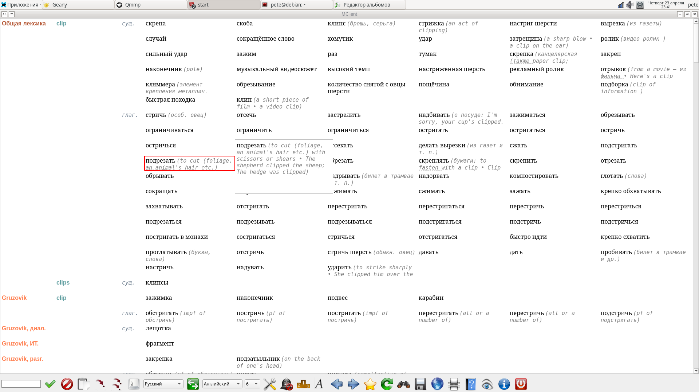

MClient is dictionary software focusing on professional translators and
linguists. As to my knowledge, this is the only application capable of ordering
article items; specifically, it can sort them by subjects, word forms, parts of
speech and so on (if the dictionary source provides corresponding tags).
Sources and subjects can be blocked or prioritized.

Various online and offline sources are supported, specifically:

- [multitran.com](https://www.multitran.com/)&mdash;possibly one of the
largest dictionaries in the world; used by professional translators.

- DSL&mdash;Lingvo dictionaries in a plain text format. LSD are compiled
dictionaries shipped with Lingvo; they can be decompiled but this will violate
its license, so only DSL dictionaries are supported. Lingvo software is also
used by professionals.

- StarDict&mdash;well-known dictionary format. There are many StarDict
dictionaries available online, but few of them have proper tagging.

- Fora&mdash;dictionary app; tries to combine different formats under the hood.

Articles are formatted as tables. Article items can be accessed in an
instant&mdash;any cell can be copied using the right mouse button or
`Ctrl+Enter` hotkey.

Please see [docs](https://github.com/sklprogs/mclient/tree/main/docs)
for the full manual.
